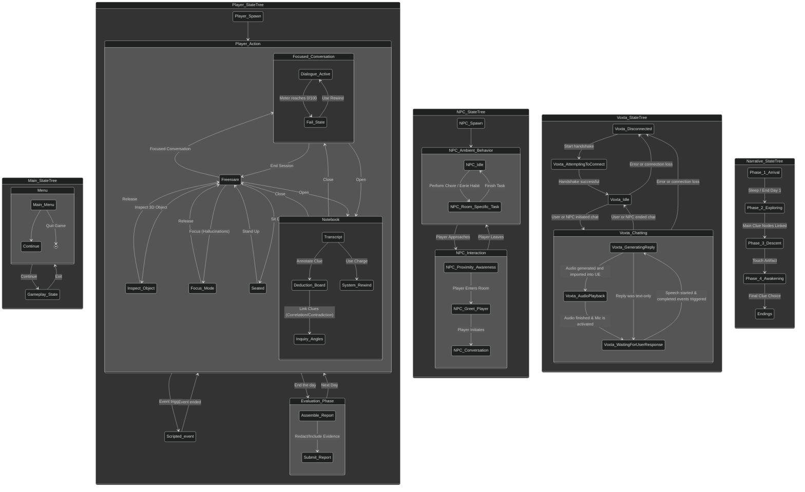

# Forgotten
Overly ambitious UE project

This project serves as a technical demonstration for the Voxta Plugin within Unreal Engine.

Full design doc: https://docs.google.com/document/d/1v4YIVGK3a4jeyPQwxP9kBmlifpGE05u5T2pBD4JELDI  
Trello board: https://trello.com/b/xFdesJSx/forgotten  
Voxta Plugin: https://github.com/grrimgrriefer/UnrealVoxta / https://dev.azure.com/grrimgrriefer/UnrealVoxta

# Coding conventions

Mostly follows UE's condings standards with the following exceptions:

* Member variables always start with `m_`.
  * Private & protected members use `m_camelCase`.
  * Public members use `m_PascalCase`.
* Local variables & parameters always are camelCase.
* When using multiple inheritance, all overrides must be grouped in `#pragma region basename` blocks
* Header files cannot contain function definitions.
* Lines cannot extend 130 chars
  * When parameters have to be split, every parameter must be on a newline in both .h and .cpp files.
* Virtual private functions should be avoided.
* Global using-declarations should be avoided.

## Header file layout

* Includes
* Forward declarations
* Class summary
* Friend declarations
* Public
  * Statics
  * Using-declarations
  * Constructor
  * Delegates (not delegathandles)
  * Virtuals & Overrides
  * Functions
  * UFunctions
  * UProperties
* Protected
  * Virtuals & Overrides
  * Functions
  * UFunctions
  * UProperties
  * Member fields
* Private
  * Functions
  * UFunctions
  * UPROPERTIES
  * Member fields

_CPP file must implement functions in the same order as used in the header file._

# Context

The user plays as a psychologist that's talking with a woman named Rain.
Set in a somewhat grounded sci-fi setting, with some cosmic horror elements later on.

The core is mainly investigation and deduction, where you have to piece things together based on what Rain says in your conversations.
Gathering clues, fragmented memories and later one hallucinations etc. Mainly just the interaction between the user and the AI driving most things so the plugin can be fleshed out and tested in an actual use case.

# Core states

